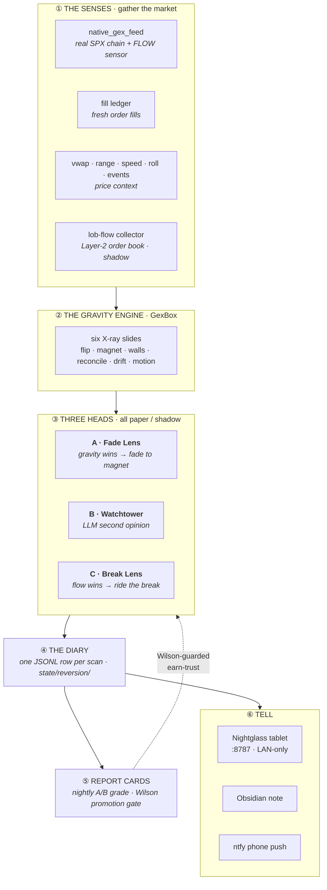

# mirai-station

**An always-on research system that watches SPX 0DTE dealer positioning and, about
once a minute, writes down what it thinks price will do — on paper.** It runs
unattended on a Mac mini, trades no real money, and only earns the right to alert
(let alone trade) once its own nightly report cards prove it beats luck.

> **Status:** paper / shadow. Every engine and every "head" writes to a diary and
> is graded nightly; nothing is live. The gate from paper → live is a
> Wilson-guarded win-rate check the record has not yet cleared — by design.

Two words carry the whole model:

- **GRAVITY** — dealer *positioning*: where hedging flows *pull* price (the magnet,
  the walls, the gamma-flip line, the long/short-gamma regime).
- **FLOW** — the live *force*: who is *shoving* price right now (aggressor tape,
  order-book pressure).

The system's core question is always the same: **does gravity hold price to its
magnet, or does flow overpower it and break away?**

Wherever a wall, magnet, or pin is *labeled* in a rendered view it uses the
standard notation from **`docs/gw-vocab.md`**: `GWc`/`GWp` (call/put gex walls),
`MagP` (magnetic pull), `Pin`, each with a `'` `''` `'''` intensity mark and a
tenor prefix (`[0DTE]`, `[1-7DTE]`, `[AUG21]`-style dates).

---

## The shape in one picture



Read it top to bottom: the **Senses** gather real option-book data and live flow →
the **Gravity Engine** turns it into a dealer map → **three heads** each make a
paper call from that map → every scan is written to the **Diary** → **Report
Cards** grade the record after the close, and the Wilson gate is the *only* path
that could ever let a head go live.

---

## The live loop (every minute during market hours)

A single launchd agent wakes every 60 s and gates itself to RTH (Mon–Fri
09:30–16:00 ET; the gate is a self-contained NYSE calendar, no network call). Each
real tick runs two phases:

1. **Scan** — `hunter.py` (the *Shift Manager*) runs the scan on **SPX** (the only
   ticker since the voters were retired):
   - the **Flow Sensor + Gravity Engine** read first and hand up the magnet, σ,
     walls, and regime;
   - the **three heads** each evaluate that map;
   - `record()` appends one row to today's **diary** (`state/reversion/<date>.jsonl`);
   - the Obsidian "Today" note and the tablet refresh.
2. **Alerts** — `watch.cli gex-alerts` runs *always* (even after hours, so the
   EOD scoring window is never missed): fresh paper fires, wall-breach mood
   re-dives, and end-of-day direction scoring push to the phone via **ntfy**.

Report cards are **not** part of the tick — they run as a separate nightly job
after the close (16:15 ET).

---

## The three heads

All three are **shadow / paper only** (`REVERSION_LIVE = False`). A "fire" is a
diary entry, not an order.

| Head | Code key | Thesis | Fires when… |
|---|---|---|---|
| **A · Fade Lens** | `reversion_extreme` | GRAVITY wins — price snaps back to the magnet | four gates all pass: **stretched** (σ from close / VWAP / wall), **pinning** regime, **reaction** (last bar turns back), and **runway** to the magnet |
| **B · Watchtower** | `watchtower` | an independent LLM "second opinion" that forecasts direction from the map | blind-then-reveal, 3-vote majority, `claude-sonnet-5`, capped 35/day. **Never touches the phone and can never place or veto a trade** — it exists only to be graded |
| **C · Break Lens** | `level_reclaim` | FLOW wins — a weakened map is overpowered and price breaks away | a two-stage *cock → fire*: gravity cocks the hammer on a rejection at the storm side; live one-way flow fires it. Recording-only |

The Fade Lens and Break Lens are opposite twins — one bets the pin holds, the other
bets it breaks. When they disagree, the hunter marks a `referee` note in the diary.

---

## The Gravity Engine (`GexBox`)

One orchestrator (`lefteye_gex_box.py`) fetches the option chain only when it
changed and re-prices it every scan into six "X-ray slides":

- **A · flip** — the banded zero-gamma zone; regime = sign of net gamma at spot.
- **B · magnet + walls** — today's 0DTE pull-strike (the MagP level, signed
  net-GEX) and the volume-weighted call/put walls ([0DTE]GWc / [0DTE]GWp).
- **C · terrain** — the stable OI-weighted structural walls ([1-7DTE]GWs).
- **D · volume overlay** — fills in empty-OI 0DTE strikes.
- **E · reconcile** — cross-checks the regime tag against live aggressor flow,
  direction-aware: a heavy buy-calls/sell-puts tape **inverts** the assumed dealer
  sign and marks either regime **UNCERTAIN** (a heavy confirming tape never trips).
  A near-balanced book at spot also reads **UNCERTAIN** — a tie, not a regime.
- **F · drift** — vanna (VEX) and charm (CEX) slow pressure into the close.

Plus a **motion** pack (`gex_motion`: walls melting, magnet walking, flip line
creeping) — the map read as film, not a photo — and a one-candle **shove test**.

When the native chain is unavailable it degrades to a **labeled** SPY-proxy: SPY's
book rescaled ×10 into index space.

---

## Data providers

| Provider | Supplies | Auth |
|---|---|---|
| **ThetaData** (via Cassandra's Edge MCP) | the **native SPX option chain** — the primary GEX source — + a Schwab-independent 1-min price path | Keychain bearer `iv-viability-cassandra` |
| **Schwab** (`schwab-py`) | daily/1-min bars, quotes, the SPY chain (the ×10 proxy) | Keychain OAuth (7-day token, kept alive by `auth-watch`) |
| **Unusual Whales Periscope** | a free, no-auth dealer-gamma heatmap — a shadow cross-check on the assumed-sign map | none |
| **Cassandra's Edge MCP** (twitter / reddit / fetch) | the morning Macro-Mood news read | per-server bearer |

The whole option-book foundation lives immutable in `state/gex_fills/`
(`native_SPX.json`, `proxy_SPY.json`); everything downstream re-prices off it.

---

## Grading & the earn-trust gate

`gex_polarity_ab.py` (the *Report Cards*) runs after the close and grades every
shadow engine and head — `gex_views` (proxy), `gex_theta` (native), the LOB
`lob_flow`/`spy_depth` sensors, the Watchtower, and the two lenses —
target-before-stop against 1-min bars, scoring both **direction polarity** and
**magnet gravitation**. Its `promotion_gate()` is a **Wilson lower-bound** check;
`reversion_lens.live_allowed()` reads it, and it is the single gate between paper
and live. Nothing has cleared it.

---

## Layout

```
mirai-station/
├── plugin.json                 skill manifest + runtime config
├── skills/
│   ├── mirai-left-eye/         the brain: hunter · reversion_lens (3 heads) ·
│   │                           lefteye_gex_box (Gravity Engine) · lefteye_dex
│   │                           (DEX direction-side twin, shadow) · profile_ladder +
│   │                           adaptive_em (display records, shadow) · native_gex_feed
│   │                           (FLOW sensor) · fill_ledger · watchtower ·
│   │                           gex_polarity_ab (grader) · uw_periscope + gex_uw_bridge
│   │                           (UW cross-check) · dashboard · price/context lenses
│   ├── lob-flow/               Layer-2 order-book FLOW sensor (shadow, self-contained)
│   ├── iv-viability/           per-contract IV gate + the Schwab credential/data vault
│   └── mirai-right-eye/        embedder only (RAG retired 2026-07-10) → feeds macro-mood
├── runtime/
│   ├── watch/                  the tick chassis: cli · hunter wrapper ·
│   │   └── intraday/           market_status · gex_alerts · push_ntfy · macro_mood · auth
│   ├── viewstation/            the "Nightglass" tablet — read-only HTTP on :8787
│   ├── launchd/                7 LaunchAgent plists (the fleet, below)
│   └── scripts/                install/venv/run wrappers + env.sh (Keychain reader)
├── state/                      diary + grades + learning + option-book (runtime-mutable)
└── docs/                       INSTALL · OPERATIONS · gex-glossary · gw-vocab ·
                                wt8-doctrine · salvage-notes
```

### The launchd fleet (7 agents)

| Label | Cadence | Job |
|---|---|---|
| `left-eye` | every 60 s (gated to RTH) | the scan + alert tick |
| `caffeinate` | continuous | keeps the mini awake |
| `lob-collector` | every 60 s | Layer-2 LOB flow collector (shadow) |
| `viewstation` | continuous | the tablet HTTP server on :8787 |
| `macro-brief` | 09:00 ET | morning Macro-Mood brief |
| `gex-polarity` | 16:15 ET | after-close A/B grader + LOB nightly fold |
| `auth-watch` | 08:00 ET | Schwab token keep-alive + dead-bearer ping |

---

## Quickstart (Mac mini)

```bash
cd ~/.claude/plugins/mirai-station
./runtime/scripts/venv-bootstrap.sh      # provision ~/.local/share/mirai-station/venv
./runtime/scripts/install-launchd.sh     # symlink + bootstrap the 7 agents
```

- **Full setup** (auto-login, Caffeinate, Keychain secrets, MCP servers, ntfy):
  `docs/INSTALL.md`
- **Runbook** (start/stop, logs, troubleshooting): `docs/OPERATIONS.md`
- **Plain-name glossary** (every code identifier → what it actually does):
  `docs/gex-glossary.md`
- **Salvage notes** (what the retired nine-voter system did, and what's worth
  bringing back): `docs/salvage-notes.md`

---

## History

Restructured **2026-07-03** into a gex-only system: the nine-voter confluence
brain, the real-trade pick builder, and the bet watcher were all retired (the Fade
Lens is the brain now). Files and docs may still carry warning-bannered notes about
that older system — treat anything mentioning *voters / confluence / pick_builder /
outcomes / oracle / algo-read* as historical. The live shape is the one this README
describes.

**mirai-station is the always-on twin.** The interactive vault stays on the main
machine; the mini emits alerts and writes its own `state/` — cross-machine vault
sync is intentionally out of scope.
