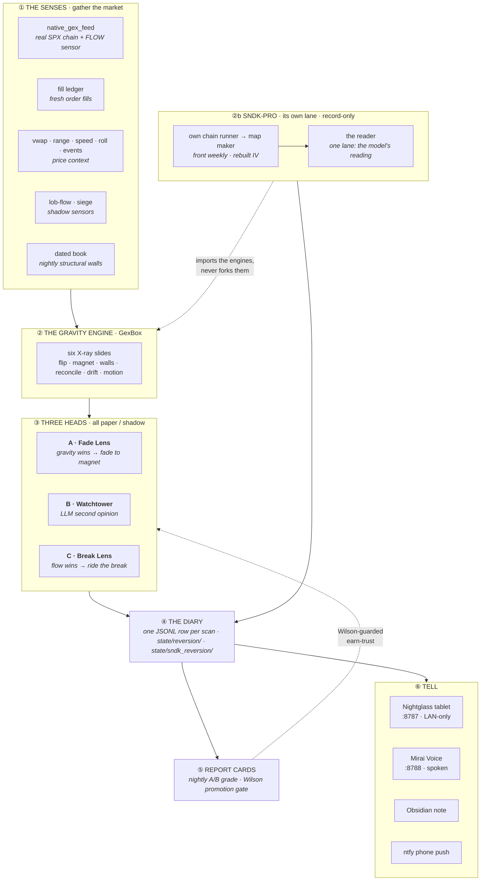

# mirai-station

**An always-on research system that watches options dealer positioning and, minute
by minute, writes down what it thinks price will do — on paper.** It runs
unattended on a Mac mini, trades no real money, and only earns the right to alert
(let alone trade) once its own nightly report cards prove it beats luck.

> **Status: paper / shadow, everywhere.** Every engine, head, and sensor writes to
> a diary and is graded; nothing is live. The gate from paper → live is a
> Wilson-guarded win-rate check the record has not yet cleared — by design.

Two words carry the whole model:

- **GRAVITY** — dealer *positioning*: where hedging flows *pull* price (the magnet,
  the walls, the gamma-flip line, the long/short-gamma regime).
- **FLOW** — the live *force*: who is *shoving* price right now (aggressor tape,
  order-book pressure).

The core question is always the same: **does gravity hold price to its magnet, or
does flow overpower it and break away?**

Wherever a wall, magnet, or pin is *labeled* in a rendered view it uses the standard
notation from **`docs/gw-vocab.md`**: `GWc`/`GWp` (call/put gex walls), `MagP`
(magnetic pull), `Pin`, each with a `'` `''` `'''` intensity mark and a tenor prefix
(`[0DTE]`, `[1-7DTE]`, `[AUG21]`-style dates).

---

## What's in the box

The station is not one program — it's a small fleet of independent pieces that share
a vocabulary, a state directory, and one launchd scheduler. Each has its own
lifecycle, its own kill switch, and its own posture.

| # | Piece | What it is | Ticker | Posture |
|---|---|---|---|---|
| 1 | **The SPX station** | The original system: senses → gravity engine → three heads → diary → report cards | SPX | paper |
| 2 | **SNDK-PRO** | A second, fully isolated GEX station for a single equity name, with its own model-written reading | SNDK | record-only |
| 3 | **SIEGE** | Shadow sensor: underlying volume spent *at* a wall, and whether that predicts the break | SPY→SPX | shadow |
| 4 | **LOB-FLOW** | Shadow sensor: Layer-2 order-book pressure | SPY | shadow |
| 5 | **Dated Book** | Nightly sidecar for far-dated structural OI walls the 0–7 DTE live fetch can't see | SPX | record-only |
| 6 | **Nightglass** | The read-only tablet view of everything above, on `:8787` | — | LAN-only |
| 7 | **Mirai Voice** | Ears + mouth: hold a spoken conversation about the SNDK board, on `:8788` | SNDK | live tool |
| 8 | **Report Cards** | The after-close grader and the single Wilson gate between paper and live | all | the referee |

Isolation is a design rule, not an accident: **SNDK-PRO imports the SPX engines and
never forks them**, SIEGE and LOB-FLOW are self-contained boxes that hand results
*in*, and the Dated Book runs in its own process against its own store so it cannot
change the scan's input distribution.

---

## The shape in one picture



Read it top to bottom: the **Senses** gather real option-book data and live flow →
the **Gravity Engine** turns it into a dealer map → **three heads** each make a paper
call from that map → every scan is written to the **Diary** → **Report Cards** grade
the record after the close, and the Wilson gate is the *only* path that could ever
let a head go live. **SNDK-PRO runs beside all of it** on its own feed, its own
schedule, and its own store — borrowing the engines, touching nothing.

---

## 1 · The SPX station

### The live loop (every minute during market hours)

A launchd agent wakes every 60 s and gates itself to RTH (Mon–Fri 09:30–16:00 ET;
the gate is a self-contained NYSE calendar, no network call). Each real tick runs
two phases:

1. **Scan** — `hunter.py` (the *Shift Manager*) runs the scan on **SPX**:
   - the **Flow Sensor + Gravity Engine** read first and hand up the magnet, σ,
     walls, and regime;
   - the **three heads** each evaluate that map;
   - `record()` appends one row to today's **diary** (`state/reversion/<date>.jsonl`);
   - the Obsidian "Today" note and the tablet refresh.
2. **Alerts** — `watch.cli gex-alerts` runs *always* (even after hours, so the EOD
   scoring window is never missed): fresh paper fires, wall-breach mood re-dives,
   and end-of-day direction scoring push to the phone via **ntfy**.

Report cards are **not** part of the tick — they run as a separate nightly job after
the close.

### The three heads

All three are **shadow / paper only** (`REVERSION_LIVE = False`). A "fire" is a diary
entry, not an order.

| Head | Code key | Thesis | Fires when… |
|---|---|---|---|
| **A · Fade Lens** | `reversion_extreme` | GRAVITY wins — price snaps back to the magnet | four gates all pass: **stretched** (σ from close / VWAP / wall), **pinning** regime, **reaction** (last bar turns back), and **runway** to the magnet |
| **B · Watchtower** | `watchtower` | an independent LLM "second opinion" that forecasts direction from the map | blind-then-reveal, 3-vote majority, `claude-sonnet-5` pinned by exact id, capped 35 judged scans/day. Since **wt-11** it may reach for exactly two tools — its own history CLI (`lefteye_rag.py` → `state/spx_rag/`, its past reads as searchable memory) and WebSearch for the catalyst behind a genuinely abnormal tape — doctrine-gated, history is context never the trigger. **Never touches the phone and can never place or veto a trade** — it exists only to be graded |
| **C · Break Lens** | `level_reclaim` | FLOW wins — a weakened map is overpowered and price breaks away | a two-stage *cock → fire*: gravity cocks the hammer on a rejection at the storm side; live one-way flow fires it. Recording-only |

The Fade Lens and Break Lens are opposite twins — one bets the pin holds, the other
bets it breaks. When they disagree, the hunter marks a `referee` note in the diary.

The Watchtower's prompt is versioned by **era** (`wt-11` current — the SNDK
sr-2→sr-5 honesty port, every threshold re-measured on the SPX tape;
`docs/spx-payload-inventory.md` is the field-by-field scene inventory and
`docs/wt8-doctrine.md` records the wt-8-era reasoning foundations). Bump the
era on any change to the payload or the prompt so a later read of the record
can never blend two rule sets.

### The Gravity Engine (`GexBox`)

One orchestrator (`lefteye_gex_box.py`) fetches the option chain only when it changed
and re-prices it every scan into six "X-ray slides":

- **A · flip** — the banded zero-gamma zone; regime = sign of net gamma at spot.
- **B · magnet + walls** — today's 0DTE pull-strike (the MagP level, signed net-GEX)
  and the volume-weighted call/put walls ([0DTE]GWc / [0DTE]GWp).
- **C · terrain** — the stable OI-weighted structural walls ([1-7DTE]GWs).
- **D · volume overlay** — fills in empty-OI 0DTE strikes.
- **E · reconcile** — cross-checks the regime tag against live aggressor flow,
  direction-aware: a heavy buy-calls/sell-puts tape **inverts** the assumed dealer
  sign and marks the regime **UNCERTAIN** (a heavy confirming tape never trips). A
  near-balanced book at spot also reads **UNCERTAIN** — a tie, not a regime.
- **F · drift** — vanna (VEX) and charm (CEX) slow pressure into the close.

Plus a **motion** pack (`gex_motion`: walls melting, magnet walking, flip line
creeping) — the map read as film, not a photo — and a one-candle **shove test**.

When the native chain is unavailable it degrades to a **labeled** SPY-proxy: SPY's
book rescaled ×10 into index space.

---

## 2 · SNDK-PRO — the isolated equity station

A second GEX station for **SNDK** (~$1,250, $5 strike grid, weekly Friday expiries),
built to prove the engines generalize off the index. It **imports** the pure left-eye
engines (`build_views`, `slide_0dte`, `dex_views`, `profile_ladder`) and the hardened
MCP transport — never forks them — and keeps every SNDK-specific rule in its own
directory. Nothing here trades, alerts, or feeds any SPX consumer.

Three facts drove its design (all live-verified, all covered by tests):

1. **Weekly expiries, not dailies.** "No expiry today" is the normal state 4 days of
   5, so the coverage teeth bite on the **front** expiry instead. Bulk expiry
   discovery is broken for SNDK, so candidate days are probed one at a time and the
   verdict is cached for the day.
2. **The chain's own spot is ~15 % stale.** Every strike window and spot-relative
   read anchors on the Schwab live quote — **no live quote → no book, no row**
   (fail-closed). The strike window is vol-adaptive, because SNDK runs ~105 % IV
   where a fixed ±8 % band would truncate the magnet's own reach.
3. **Provider IVs are computed off that stale spot** and are garbage near the money.
   IV is **rebuilt** per strike from the live bid/ask mid of the OTM right and shared
   with its parity twin; gamma is recomputed from the rebuilt IV.

**One lane, on purpose (obs-3).** The deterministic arrow — Lane A — was removed on 2026-09-01: it was a direction surface on a system whose redesign measured the direction call at zero forward value, its own content pointed at the nearest round hundred on 94% of audited episodes, and its state changes spent 11% of model calls waking an observer that was forbidden from ever seeing it. The model's reading is the only live lane; old read rows keep their `arrow` field as history.

The blunt findings that shaped it — measured over four recorded sessions, 756 rows:
12 of ~20 candidate payload fields were **constants** (one read *"Dealers sell into
strength"* on 756/756 rows, through a **+12 %** day); the magnet is a **tie** more
often than not, so it ships as a band, never a scalar; the old arrow pointed **8×
further than price travels** in the window it implied. Nothing on this surface is
outside the noise band, and nothing here is presented as an edge.

A **pause** switch (`state/sndk_reads/control.json`, flipped from the tablet) silences
the model's *sentence* and nothing else — the gates and rankings are pure
functions of a row already on disk, so every scan still lands a row, stamped
`paused: true`. A gap in a training set costs more than a gap in the prose. Both
readers fail **open**.

Details: `skills/sndk-pro/README.md`.

---

## 3 · SIEGE — effort at the towers *(shadow)*

A self-contained sensor box measuring one thing: how much underlying volume gets
spent while spot is **touching** a dealer-gamma level, and whether that effort
predicts the level breaking or holding.

> **The sign is reversed, and that is the whole point.** Backtest sweep (n = 168
> touches, 11 of 13 days agreeing): **high volume at a wall touch predicts the wall
> BREAKS.** Sieged walls held 39 % of the time vs 54 % for quiet touches. The
> intuitive read — "defenders absorbing heavy volume = strong level" — is the wrong
> sign on this tape. Never flip the labels back without a new sweep.

`SIEGE` (effort ≥ 70th pct) → expect break · `QUIET` (≤ 30) → expect hold ·
`NEUTRAL` in the middle. Wired into the Watchtower payload since wt-7; graded
record-only. Details: `skills/siege/README.md`.

## 4 · LOB-FLOW — order-book pressure *(shadow)*

A Layer-2 order-book FLOW sensor, collected on its own 60 s job and folded nightly.
Distinct from the options aggressor tape: this measures the *stock* book. Promotion
gate dormant. Details: `skills/lob-flow/README.md`.

## 5 · The Dated Book sidecar *(record-only)*

The live fetch is 0–7 DTE only, so multi-month structural OI walls (the 7000/8000-class
round numbers sitting on every monthly) are visible only during OpEx week and vanish
the rest of the month — while persisting in the market. This sidecar pulls exactly two
extra bands nightly (the next two AM 3rd-Friday monthlies, the next two SPXW
quarter-end expiries) into its own store.

Its blast-radius contract is the design: **separate process** (never inside a scan
tick — the scan side is a cache-only file read), **separate store**, **magnitude only**
(no signed field to misuse, since assumed sign disagrees with flow-inferred sign ~44 %
of the time), and **fail-open** (an error leaves the last good book untouched).

---

## 6 · Nightglass — the tablet view

A read-only web app on **`:8787`** showing the live state on the mini. Seven surfaces:

| Tab | What it shows |
|---|---|
| **Map** | The live SPX dealer map — towers, walls, magnet, flip band, heat ladder, and the Watchtower's current read |
| **Layers** | Data feeds → sensory layers → lenses → processor, as a stack; tap any block for what it does |
| **Diary** | The night log: every Watchtower call, grouped by day |
| **Processor** | The Sweep Ledger — every call graded by signed area, the day on one page |
| **Replay** | How each call actually played out, scrubbed over any past day from `state/reversion/*.jsonl` |
| **Dictionary** | How walls, magnets and pins are written everywhere on this station (`docs/gw-vocab.md` in plain English) |
| **SNDK** β | The SNDK board, the model's reading, the 🎙 talk button, and the reasoning pause |

It reuses the project's own renderers, so every number matches the canonical views.
**LAN-only by design: read-only, no auth, and the SNDK reasoning toggle is the only
write the server accepts.** Don't port-forward it. Details:
`runtime/viewstation/README.md`.

## 7 · Mirai Voice — the desk, spoken

Press the talk button on the SNDK tab and hold an open conversation about the board.
A WebSocket sidecar on **`:8788`** with server-side VAD turn-taking, barge-in, and a
3-minute auto-off.

| Organ | What it does |
|---|---|
| **Ears** | Parakeet (MLX) — PCM in, transcript out, ~160 ms, plus a jargon fixer ("jex" → GEX, "san disk" → SNDK) |
| **The mind-link** | One `ClaudeSDKClient` session held open per trading day (subscription auth, streaming), so a turn costs no CLI spawn; injects the reader's own scene per turn; the RAG history CLI is its only tool |
| **Mouth** | Kokoro TTS at 24 kHz, `say` fallback |

Scope: **SNDK only, by doctrine.** The mic needs a secure context — localhost on the
Mac works today; the iPad needs the HTTPS cert step. Details:
`skills/mirai-voice/README.md`.

## 8 · Grading & the earn-trust gate

`gex_polarity_ab.py` (the *Report Cards*) runs after the close and grades every shadow
engine and head — `gex_views` (proxy), `gex_theta` (native), the LOB `lob_flow` /
`spy_depth` sensors, SIEGE, the Watchtower, and the two lenses — target-before-stop
against 1-min bars, scoring both **direction polarity** and **magnet gravitation**.

Its `promotion_gate()` is a **Wilson lower-bound** check; `reversion_lens.live_allowed()`
reads it, and it is the single gate between paper and live. **Nothing has cleared it.**

---

## Data providers

| Provider | Supplies | Auth |
|---|---|---|
| **ThetaData** (via Cassandra's Edge MCP) | the **native SPX option chain** — the primary GEX source — the SNDK chain, and a Schwab-independent 1-min price path | Keychain bearer `iv-viability-cassandra` |
| **Schwab** (`schwab-py`) | daily/1-min bars, live quotes, the SPY chain (the ×10 proxy) | Keychain OAuth (7-day token, kept alive by `auth-watch`) |
| **Cassandra's Edge MCP** (twitter / reddit / fetch) | the morning Macro-Mood news read | per-server bearer |
| **Claude** (subscription) | the Watchtower vote and the SNDK reading via one-shot `claude -p`; the voice conversation via a held-open `claude-agent-sdk` day session (a CLI spawn costs 7–100 s — far too slow to speak) | Claude Code CLI login — **no API key** |

The whole option-book foundation lives immutable in `state/gex_fills/`
(`native_SPX.json`, `proxy_SPY.json`); everything downstream re-prices off it.

---

## Layout

```
mirai-station/
├── plugin.json                 skill manifest + runtime config
├── skills/
│   ├── mirai-left-eye/         the SPX brain: hunter · reversion_lens (3 heads) ·
│   │                           lefteye_gex_box (Gravity Engine) · native_gex_feed
│   │                           (FLOW sensor) · watchtower · dated_gex_feed (sidecar) ·
│   │                           lefteye_dex (direction-side twin, shadow) ·
│   │                           profile_ladder + adaptive_em (display, shadow) ·
│   │                           fill_ledger · gex_polarity_ab (grader) ·
│   │                           siege_bridge · lob_bridge · dashboard · price lenses
│   ├── sndk-pro/               the isolated SNDK station: feed · views · hunter ·
│   │                           read (model reading) · rag (on-demand memory)
│   ├── mirai-voice/            ears · jargon · convo · doctrine · mouth · voice_server
│   ├── siege/                  effort-at-the-wall sensor (shadow, self-contained)
│   ├── lob-flow/               Layer-2 order-book FLOW sensor (shadow, self-contained)
│   ├── iv-viability/           per-contract IV gate + the Schwab credential/data vault
│   └── mirai-right-eye/        embedder only (RAG retired 2026-07-10) → feeds macro-mood
├── runtime/
│   ├── watch/                  the tick chassis: cli · hunter wrapper ·
│   │   └── intraday/           market_status · gex_alerts · push_ntfy · macro_mood · auth
│   ├── viewstation/            "Nightglass" — read-only HTTP on :8787
│   ├── launchd/                11 LaunchAgent plists (the fleet, below)
│   └── scripts/                install/venv/run wrappers + env.sh (Keychain reader)
├── state/                      runtime-mutable — never copied between machines
│   ├── reversion/              the SPX diary + nightly grades
│   ├── spx_rag/                the Watchtower's memory (slices · summaries · terrain)
│   ├── sndk_reversion/ sndk_reads/ sndk_gex/ sndk_rag/   the SNDK station
│   ├── gex_fills/ dated_gex/ gex_learn/ gex_uw/          the book + learned baselines
│   ├── siege/ lob_flow/ market_expectation/ tape_prev/   the shadow sensors
│   └── voice/ logs/            conversation log + session continuity
└── docs/                       INSTALL · OPERATIONS · gex-glossary · gw-vocab ·
                                wt8-doctrine · spx-payload-inventory ·
                                sndk-payload-inventory · salvage-notes
```

### The launchd fleet (11 agents)

| Label | Cadence | Job |
|---|---|---|
| `left-eye` | every 60 s (gated to RTH) | the SPX scan + alert tick |
| `sndk` | every 120 s (gated to RTH) | the SNDK scan tick |
| `sndk-read` | every 120 s (gated to RTH) | the SNDK reading — **its own job on purpose**, so a hung model call can never eat a diary row |
| `lob-collector` | every 60 s | Layer-2 LOB flow collector (shadow) |
| `viewstation` | continuous | the Nightglass HTTP server on :8787 |
| `voice` | continuous | the voice WebSocket sidecar on :8788 |
| `caffeinate` | continuous | keeps the mini awake |
| `auth-watch` | 08:00 ET | Schwab token keep-alive + dead-bearer ping |
| `dated-book` | 08:17 ET daily, + Fri 17:10 ET | the far-dated structural-wall sidecar |
| `macro-brief` | 09:00 ET | morning Macro-Mood brief |
| `gex-polarity` | 16:15 ET | after-close A/B grader + LOB nightly fold |

### Kill switches

Every optional subsystem can be turned off without touching code. The four that own a
launchd job are checked in the shell wrapper **and** again in Python, so neither path
can be missed.

| Variable | Silences |
|---|---|
| `WATCHTOWER_DISABLE=1` | the LLM second opinion |
| `SNDK_PRO_DISABLE=1` | the SNDK scanner (**and**, implicitly, its reading — with no fresh rows, reading on would only re-narrate a frozen book) |
| `SNDK_READ_DISABLE=1` | the SNDK reading only |
| `MIRAI_VOICE_DISABLE=1` | the voice sidecar |
| `DATED_BOOK_DISABLE=1` | the far-dated sidecar |
| `SIEGE_DISABLE=1` | the effort-at-the-wall sensor |
| `MAGNET_V3_DISABLE=1` | falls the magnet back to the pre-v3 rule |

The SNDK reasoning **pause** is deliberately *not* a kill switch — see §2.

---

## Quickstart (Mac mini)

```bash
cd ~/.claude/plugins/mirai-station
./runtime/scripts/venv-bootstrap.sh      # provision ~/.local/share/mirai-station/venv
./runtime/scripts/install-launchd.sh     # symlink + bootstrap the 11 agents
```

Then:

Always name the venv interpreter explicitly. There is only one interpreter with
`schwab-py` + `httpx`, and nothing here is meant to run under a system `python3` —
but the shebangs are `#!/usr/bin/env python3` (an absolute path would hardcode one
machine's home directory), so `./script.py` gets system python and most signal
modules silently fail. The launchd path is unaffected: every `run-*.sh` calls
`"${MIRAI_STATION_VENV}/bin/python"` explicitly.

```bash
PY=~/.local/share/mirai-station/venv/bin/python

./runtime/scripts/run-watch-left-eye.sh                    # one SPX tick by hand
$PY skills/sndk-pro/sndk_hunter.py --force                 # one SNDK tick, off-hours
$PY skills/sndk-pro/sndk_read.py --replay YYYY-MM-DD       # re-run a recorded day, writes nothing
$PY skills/mirai-voice/repl.py --mute                      # the whole voice loop in a terminal
```

Tests — **one suite directory at a time** (each box ships its own `conftest.py`, and
they collide if collected together):

```bash
for t in skills/mirai-left-eye/tests skills/sndk-pro/tests skills/siege/tests \
         skills/lob-flow/tests skills/iv-viability/tests runtime/watch/tests; do
  $PY -m pytest "$t" -q
done                                                       # ~1,150 tests
```

- **Full setup** (auto-login, Caffeinate, Keychain secrets, MCP servers, ntfy):
  `docs/INSTALL.md`
- **Moving to new hardware**: `TRANSFER.md`
- **Runbook** (start/stop, logs, troubleshooting): `docs/OPERATIONS.md`
- **Plain-name glossary** (every code identifier → what it actually does):
  `docs/gex-glossary.md`
- **Label notation** (`GWc`/`GWp`/`MagP`/`Pin` + primes): `docs/gw-vocab.md`
- **Watchtower reasoning doctrine** (wt-8-era foundations): `docs/wt8-doctrine.md`
- **SPX scene, field by field** (wt-11): `docs/spx-payload-inventory.md`
- **SNDK scene, field by field**: `docs/sndk-payload-inventory.md`

There is also a human-facing, numbered walkthrough of the whole project at
`~/Desktop/Mirai-Awakening/` — an organized window of symlinks into this directory,
with a plain-English `README.md` in every folder. Edit through it and you are editing
the real files; the machine always runs from the plugin location.

---

## History

Restructured **2026-07-03** into a gex-only system: the nine-voter confluence brain,
the real-trade pick builder, and the bet watcher were retired (the Fade Lens is the
brain now). An earlier "Mirai Watch" LangGraph tick-graph and a LanceDB news store
went with them. Treat anything mentioning *voters / confluence / pick_builder /
outcomes / oracle / algo-read / langgraph* as historical — the live shape is the one
this README describes. What the retired system did, and what's worth bringing back,
is recorded in `docs/salvage-notes.md`.

**mirai-station is the always-on twin.** The interactive vault stays on the main
machine; the mini emits alerts and writes its own `state/` — cross-machine vault sync
is intentionally out of scope.
